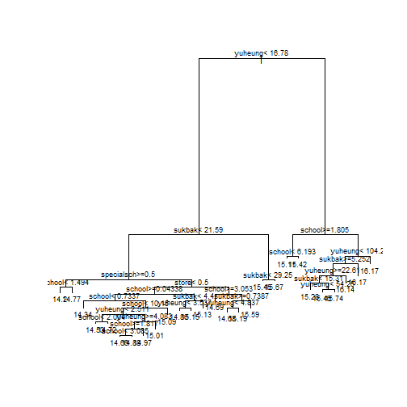

---
output:
  word_document: default
  html_document: default
---

통계학과 진리장학금 빅데이터 분석 보고서

서울시 동별 지가와 관련된 지리적 요인 탐색
--------------------------------------------------------------------------


 1. 분석 목표

 교통편의성, 학군, 인구, 재개발 계획 등의 요인들은 (공시)지가에 직접 영향을 준다고 명시적으로 알려져 있다. 하지만 이 외에도 다양한 요인들이 영향을 미칠 수 있다고 알려져 있으며, 특히 한국 사회에서는 ‘집값’이 굉장히 민감한 이슈이기 때문에 관련 요인에 대한 관심은 항상 뜨거운 편이다. 예를 들어, 최근 강서구에서는 특수학교 건립을 반대하는 주민들이 지가 및 주택 가격을 떨어뜨린다는 주장을 제기하며 장애학생 부모와 갈등을 빚은 바 있다. 이에 본 분석에서는 지가에 영향을 미칠 수 있다고 여겨지는 잠재적 변수인 특수학교, 대형병원, 유흥업소, 숙박업소, 대형마트 등 주요 시설⋅인프라의 분포가 실제로도 지가와 관련되어 있는지 탐색해보고자 한다.


 2. 데이터 소개
 
  1) 반응변수: 2017년 서울특별시 법정동별 개별공시지가
  
   - 출처: 서울 열린데이터 광장 - 서울시 개별공시지가 정보
      
      (https://data.seoul.go.kr/openinf/fileview.jsp?infId=OA-1180)
      
   - 정의
   
   개별공시지가는 표준지공시지가를 이용하여 산정한 개별토지의 단위면적당 가격이다. 
   국토교통부장관은 매년 전국의 토지 중 대표성이 높은 표준지를 선정하고, 단위면적(m2)당 적정가격인 표준지공시지가를 결정하며 시장·군수·구청장은 표준지의 공시지가를 바탕으로 하여 개별토지의 단위면적당 적정가격인 개별공시지가를 산정한다. 개별공시지가는 개별토지의 용도(주거용, 상업용, 공업용 등), 도로·교통조건, 토지이용규제사항 등을 유사한 이용가치를 가진 표준지와 비교하여 토지가격비준표에 의해 산출된 가격배율에 표준지공시지가를 곱하여 산정된다.
   
   - 전처리 과정
   
   단위면적당 가격이기 때문에 같은 법정동 내에 여러 행의 토지 가격 정보가 포함되어 있었다. 따라서 행정구와 법정동을 기준으로 평균을 내어 해당 구 또는 동의 지가를 계산하였다. 
   
  2) 설명변수: 동별 대형마트, 특수학교, 대형병원, 유흥·단란주점, 숙박업소, 학교 개수
   
   - 출처: 서울 열린데이터 광장
   
   - 기본 전처리
   
   업체 주소 자료로부터 행정구역 정보(자치구명, 법정동명)를 추출하였다.
주소 자료에 법정동명이 아닌 행정동명이 입력되어있는 경우 법정동명으로 변경하였다.
결측값의 경우 직접 네이버 주소검색을 이용하여 행정구역 정보를 추출하여 채워넣었다. 
법정동별로 해당하는 자료의 개수에 대한 빈도표를 작성하였으며, 분석에는 이 빈도 데이터를 사용하였다.
   
   (법정동: 옛 지명 등에서 유래된 이름을 사용하여 법으로 정한 동으로 모든 정부 기관의 공무나 재산권 및 권리행사 등의 법률행위에 사용되는 동. 변동이 거의 없다.
   
   행정동: 행정 운영의 편의를 위하여 설정한 행정구역으로 도시의 확장, 인구의 이동 등 지역여건 변화와 주민 수의 증감에 따라 수시로 설치 또는 폐지할 수 있는 동)
   
   현재 서울특별시에는 총 25개 구, 467개의 법정동이 존재하며, 이름이 같은 동이 서로 다른 구에 있는 경우가 두 가지 존재하므로 (신사동: 강남구, 은평구 / 신정동: 양천구, 마포구) 같은 값으로 처리되지 않도록 구분하였다. 
   
   - 데이터별 특이사항
   
   유흥주점과 단란주점은 법적으로는 구분되어 있으나 이번 분석에서는 구별할 필요가 없으므로 '유흥업소'라는 상위 카테고리로 묶어서 고려하였다.
   
   유흥업소, 대형마트, 숙박업소 등은 폐업한 업소도 데이터셋에 포함되어 있으므로 현재 영업 중인 곳만 추출하여 사용하였다. 
   
   대형마트 데이터는 법적으로 매장 면적이 3000m^2 이상인 대형마트와 아울렛, 백화점 목록이다. 이 중 목록 안에 있더라도 식료품이나 의류, 생활용품을 종합적으로 판매하지 않는 곳은 삭제하였다. (예: 세운상가 등 전자상가 삭제, GS슈퍼 등 의류매장이 없는 슈퍼형 마트 삭제)
	
	또한 각 대형마트 홈페이지에 명시되어있는 점포 개수와 비교하여 목록에 없는 경우 추가하였다.
	마트와 백화점이 붙어있는 경우 각각 따로 집계하였다.
	아울렛 내에 있는 식료품매장이 따로 목록에 있는 경우 아울렛에 포함하여 하나로 집계하였다.
	
	당초 계획에서는 녹지 및 공원도 설명변수로 사용하려 하였으나 녹지, 공원의 면적이 천차만별이기 때문에 법정동별 개수로 활용하는 것은 합리적이지 못하다고 판단하였다.
	더불어 그 용도나 관리 실태 또한 다양하기 때문에 법정동별 면적으로 활용하는 것도 합리적이지 못하다고 판단하였다.
	따라서 녹지, 공원 변수는 설명변수 목록에서 제외하였다.
	
	
	- 변수 변환
	
숙박업소, 유흥업소, 학교의 경우 동별 개수 데이터가 동별 면적의 영향을 받을 것이므로 해당 법정동의 면적으로 나누어 1km^2당 개수로 변환하였다.

<!-- ```{r landsize_merge, echo=FALSE} -->
<!-- # 동별 면적 데이터 불러오기 -->
<!-- landsize <- read.csv("landsize_dong.csv", header=T) -->
<!-- names(landsize)[2] <- "dong" -->
<!-- names(landsize)[3] <- "landsize" -->
<!-- landsize <- landsize[, c(1, 2, 3)] -->

<!-- # 설명변수 dataset과 합치기 (merge) -->
<!-- dat <- read.csv("dataset_dong.csv", header=T) -->
<!-- dat <- merge(dat, landsize) -->
<!-- newDat <- dat -->
<!-- ``` -->

<!-- ```{r landsize_cleaning} -->
<!-- newDat$yuheung <- newDat$yuheung / newDat$landsize -->
<!-- newDat$sukbak <- newDat$sukbak / newDat$landsize -->
<!-- newDat$school <- newDat$school / newDat$landsize -->
<!-- # 1m^2당 개수이므로 10^6을 곱하여 1km^2당 개수로 변환 -->
<!-- newDat$yuheung <- newDat$yuheung * 10^6 -->
<!-- newDat$sukbak <- newDat$sukbak * 10^6 -->
<!-- newDat$school <- newDat$school * 10^6 -->
<!-- ``` -->

<!-- 대형마트, 대형병원, 특수학교의 경우 기본적으로 전체 업체 수가 적고 좁은 구역에 집중되어 있는 경향이 있으므로 0 또는 1의 바이너리 변수로 변환하였다. -->

<!-- ```{r binary_dist, echo=FALSE} -->
<!-- print(paste0("특수학교 존재하는 동 비율: ", length(dat$specialsch[dat$specialsch>=1])/nrow(dat))) -->
<!-- print(paste0("학교 존재하는 동 비율: ", length(dat$school[dat$school>=1])/nrow(dat))) -->
<!-- print(paste0("병원 존재하는 동 비율: ", length(dat$hospital[dat$hospital>=1])/nrow(dat))) -->
<!-- print(paste0("대형마트 존재하는 동 비율: ", length(dat$store[dat$store>=1])/nrow(dat))) -->
<!-- print(paste0("숙박업소 존재하는 동 비율: ", length(dat$sukbak[dat$sukbak>=1])/nrow(dat))) -->
<!-- print(paste0("유흥업소 존재하는 동 비율: ", length(dat$yuheung[dat$yuheung>=1])/nrow(dat))) -->
<!-- ``` -->


<!-- ```{r binary_cleaning} -->
<!-- # 1 이상의 값의 비율이 매우 낮은 특수학교, 병원, 대형마트만 binary variable로 변환 -->
<!-- for (i in 1:nrow(newDat)) { -->
<!--   if (newDat$specialsch[i] >= 1) { -->
<!--     newDat$specialsch[i] <- 1 -->
<!--   } else newDat$specialsch[i] <- 0 -->
<!-- } -->

<!-- for (i in 1:nrow(newDat)) { -->
<!--   if (newDat$hospital[i] >= 1) { -->
<!--     newDat$hospital[i] <- 1 -->
<!--   } else newDat$hospital[i] <- 0 -->
<!-- } -->

<!-- for (i in 1:nrow(newDat)) { -->
<!--   if (newDat$store[i] >= 1) { -->
<!--     newDat$store[i] <- 1 -->
<!--   } else newDat$store[i] <- 0 -->
<!-- } -->

<!-- dat <- newDat -->
<!-- ``` -->

3. 탐색적 데이터 분석 

 1) 반응변수 분포
 
  - 동별 평균 지가
  


데이터의 분포가 한 쪽으로 쏠려 있기 때문에 자연로그를 취하여 정규분포에 가깝게 변환하였다. 
  

```r
hist(log(dat$landvalue), main="log(동별 평균 지가) 분포", xlab = "log(동별 지가)")
```


```r
dat$landvalue <- log(dat$landvalue)
```


 2) 설명변수 분포

4. 모델 만들기

 1) Train & Test data 나누기


```r
dat <- dat[, -c(1, 9, 10)]
set.seed(1234)
randomindex <- sample(1:nrow(dat), size=round(nrow(dat)*0.8), replace=F)
train_x <- dat[randomindex, -1]
test_x <- dat[-randomindex, -1]

train_y <- dat[randomindex, 1]
test_y <- dat[-randomindex, 1]

traindat <- data.frame(train_x, train_y)
testdat <- data.frame(test_x, test_y)
```


 2) 선형회귀분석
 
 - 모델 적합

```r
lmFit <- lm(train_y ~ ., data = traindat)
summary(lmFit)
```

```
## 
## Call:
## lm(formula = train_y ~ ., data = traindat)
## 
## Residuals:
##      Min       1Q   Median       3Q      Max 
## -3.14381 -0.35709 -0.07474  0.32659  2.25568 
## 
## Coefficients:
##               Estimate Std. Error t value Pr(>|t|)    
## (Intercept) 15.1071591  0.0489472 308.642  < 2e-16 ***
## yuheung      0.0016661  0.0007105   2.345  0.01956 *  
## sukbak       0.0023476  0.0012141   1.934  0.05393 .  
## school      -0.0130516  0.0099538  -1.311  0.19060    
## specialsch  -0.4280901  0.1532136  -2.794  0.00548 ** 
## hospital    -0.2153609  0.1239291  -1.738  0.08309 .  
## store        0.1624241  0.1049061   1.548  0.12242    
## ---
## Signif. codes:  0 '***' 0.001 '**' 0.01 '*' 0.05 '.' 0.1 ' ' 1
## 
## Residual standard error: 0.6979 on 367 degrees of freedom
## Multiple R-squared:  0.1396,	Adjusted R-squared:  0.1255 
## F-statistic: 9.924 on 6 and 367 DF,  p-value: 3.715e-10
```

```r
lmFit_null <- lm(train_y ~ 1, data = traindat)
```

 적합한 모델을 이용하여 변수선택 단계를 진행하였다.
 


 - 변수선택 결과

```r
summary(forward)
```

```
## 
## Call:
## lm(formula = train_y ~ yuheung + specialsch + sukbak + hospital + 
##     store, data = traindat)
## 
## Residuals:
##      Min       1Q   Median       3Q      Max 
## -3.11727 -0.35460 -0.08675  0.32154  2.28020 
## 
## Coefficients:
##               Estimate Std. Error t value Pr(>|t|)    
## (Intercept) 15.0806251  0.0446117 338.042  < 2e-16 ***
## yuheung      0.0017080  0.0007104   2.404  0.01671 *  
## specialsch  -0.4367770  0.1532198  -2.851  0.00461 ** 
## sukbak       0.0023669  0.0012152   1.948  0.05221 .  
## hospital    -0.2194901  0.1240101  -1.770  0.07757 .  
## store        0.1631881  0.1050070   1.554  0.12103    
## ---
## Signif. codes:  0 '***' 0.001 '**' 0.01 '*' 0.05 '.' 0.1 ' ' 1
## 
## Residual standard error: 0.6986 on 368 degrees of freedom
## Multiple R-squared:  0.1356,	Adjusted R-squared:  0.1238 
## F-statistic: 11.54 on 5 and 368 DF,  p-value: 2.276e-10
```

```r
summary(backward)
```

```
## 
## Call:
## lm(formula = train_y ~ yuheung + sukbak + specialsch + hospital + 
##     store, data = traindat)
## 
## Residuals:
##      Min       1Q   Median       3Q      Max 
## -3.11727 -0.35460 -0.08675  0.32154  2.28020 
## 
## Coefficients:
##               Estimate Std. Error t value Pr(>|t|)    
## (Intercept) 15.0806251  0.0446117 338.042  < 2e-16 ***
## yuheung      0.0017080  0.0007104   2.404  0.01671 *  
## sukbak       0.0023669  0.0012152   1.948  0.05221 .  
## specialsch  -0.4367770  0.1532198  -2.851  0.00461 ** 
## hospital    -0.2194901  0.1240101  -1.770  0.07757 .  
## store        0.1631881  0.1050070   1.554  0.12103    
## ---
## Signif. codes:  0 '***' 0.001 '**' 0.01 '*' 0.05 '.' 0.1 ' ' 1
## 
## Residual standard error: 0.6986 on 368 degrees of freedom
## Multiple R-squared:  0.1356,	Adjusted R-squared:  0.1238 
## F-statistic: 11.54 on 5 and 368 DF,  p-value: 2.276e-10
```

```r
summary(stepwise)
```

```
## 
## Call:
## lm(formula = train_y ~ yuheung + sukbak + specialsch + hospital + 
##     store, data = traindat)
## 
## Residuals:
##      Min       1Q   Median       3Q      Max 
## -3.11727 -0.35460 -0.08675  0.32154  2.28020 
## 
## Coefficients:
##               Estimate Std. Error t value Pr(>|t|)    
## (Intercept) 15.0806251  0.0446117 338.042  < 2e-16 ***
## yuheung      0.0017080  0.0007104   2.404  0.01671 *  
## sukbak       0.0023669  0.0012152   1.948  0.05221 .  
## specialsch  -0.4367770  0.1532198  -2.851  0.00461 ** 
## hospital    -0.2194901  0.1240101  -1.770  0.07757 .  
## store        0.1631881  0.1050070   1.554  0.12103    
## ---
## Signif. codes:  0 '***' 0.001 '**' 0.01 '*' 0.05 '.' 0.1 ' ' 1
## 
## Residual standard error: 0.6986 on 368 degrees of freedom
## Multiple R-squared:  0.1356,	Adjusted R-squared:  0.1238 
## F-statistic: 11.54 on 5 and 368 DF,  p-value: 2.276e-10
```

```r
# 세 방법 모두 숙박업소와 특수학교를 유의한 변수로 분류하였다.

par(mfrow=c(2, 2))
plot(forward)
```


 - 예측

```r
pred_lm <- predict(forward, testdat)
mean((pred_lm - testdat$test_y)^2)
```

```
## [1] 0.5124795
```

```r
par(mfrow=c(1, 1))
plot(pred_lm ~ testdat$test_y)
abline(a=0, b=1, col="red", lwd=2)
```


```r
cor(pred_lm, testdat$test_y)
```

```
## [1] 0.4259911
```

 - 결과 해석: 숙박업소와 특수학교가 유의한 변수로 분류되었다. 
 
 숙박업소가 많이 분포한 지역은 업무지구보다는 유동인구가 적지만 주거지구보다는 유동인구가 많은 터미널 주변이나 각 행정구의 중심지에 해당한다. 따라서 숙박업소가 많은 곳이라면 그렇지 않은 곳보다 지가가 조금 더 높을 것이라고 예상할 수 있다.
 
 특수학교의 경우 특수학교가 위치한 동은 그렇지 않은 동보다 지가가 상당히 낮다는 결과가 도출되었다. 하지만 이는 상관관계일 뿐 인과관계가 아니므로 선후관계를 함부로 단정지을 수 없다. 장애인은 비장애인보다 저소득층 비율이 높은 집단이기 때문에, 소득 및 생활 수준이 상대적으로 낮은 구 및 동에 장애인 거주 비율이 높을 수밖에 없다. 특수학교가 장애인 거주 비율이 높은 지역에 설립된 것이지, 특수학교 설립에 영향을 받아 지가가 하락했다는 추론에는 타당성이 부족하다. 
 
 3) 회귀나무 (Regression Tree)
 
  - tree library를 이용한 회귀나무 모델

```r
library(tree)
```

```
## Warning: package 'tree' was built under R version 3.6.2
```

```r
tree.fit <- tree(train_y ~ ., data=traindat)    
tree.fit
```

```
## node), split, n, deviance, yval
##       * denotes terminal node
## 
##  1) root 374 207.800 15.14  
##    2) yuheung < 16.7776 275 117.400 14.92  
##      4) sukbak < 21.5919 249  93.630 14.85  
##        8) specialsch < 0.5 228  87.530 14.88 *
##        9) specialsch > 0.5 21   3.992 14.55 *
##      5) sukbak > 21.5919 26  10.690 15.60 *
##    3) yuheung > 16.7776 99  39.840 15.76  
##      6) school < 1.80498 79  30.090 15.88  
##       12) yuheung < 104.162 60  22.560 15.79  
##         24) sukbak < 5.25189 17   3.353 16.17 *
##         25) sukbak > 5.25189 43  15.850 15.64  
##           50) yuheung < 22.6084 7   3.981 16.14 *
##           51) yuheung > 22.6084 36   9.784 15.55 *
##       13) yuheung > 104.162 19   5.430 16.17 *
##      7) school > 1.80498 20   3.330 15.25 *
```

```r
summary(tree.fit)
```

```
## 
## Regression tree:
## tree(formula = train_y ~ ., data = traindat)
## Variables actually used in tree construction:
## [1] "yuheung"    "sukbak"     "specialsch" "school"    
## Number of terminal nodes:  8 
## Residual mean deviance:  0.35 = 128.1 / 366 
## Distribution of residuals:
##     Min.  1st Qu.   Median     Mean  3rd Qu.     Max. 
## -2.91700 -0.30140  0.01296  0.00000  0.28350  1.88900
```


```r
tree.pred <- predict(tree.fit, testdat)
mean((tree.pred - testdat$test_y)^2)
```

```
## [1] 0.4290245
```

```r
plot(tree.pred ~ testdat$test_y)
abline(a=0, b=1, col="red", lwd=2)
```


```r
cor(tree.pred, testdat$test_y)
```

```
## [1] 0.5634212
```


```r
tree.CV <- cv.tree(tree.fit, K=10, FUN=prune.tree)

# Deviance에 대한 plot
plot(tree.CV)
```


```r
tree.CV$size[tree.CV$dev==min(tree.CV$dev)] # deviance를 최소화하는 가지의 개수
```

```
## [1] 4
```

```r
tree.prune <- prune.tree(tree.fit, best=3)
plot(tree.prune)
text(tree.prune, cex=.75)
```


```r
tree.pred2 <- predict(tree.prune, testdat)
mean((tree.pred2 - testdat$test_y)^2)
```

```
## [1] 0.4357781
```

```r
plot(tree.pred2 ~ testdat$test_y)
abline(a=0, b=1, col="red", lwd=2)
```


```r
cor(tree.pred2, testdat$test_y)
```

```
## [1] 0.5432129
```
 
  - rpart library를 이용한 회귀나무 모델
  

```r
library(rpart)
rpart.fit <- rpart(train_y~., data=traindat, control = rpart.control(cp=0.001))
```


```r
plot(rpart.fit)
text(rpart.fit, cex=.75, pretty=0)
```




```r
pred.rp <- predict(rpart.fit, testdat)
mean((pred.rp - testdat$test_y)^2)
```

```
## [1] 0.4136517
```

```r
plot(pred.rp ~ testdat$test_y)
abline(a=0, b=1, col="red", lwd=2)
```


```r
cor(pred.rp, testdat$test_y)
```

```
## [1] 0.5868259
```


```r
printcp(rpart.fit)
```

```
## 
## Regression tree:
## rpart(formula = train_y ~ ., data = traindat, control = rpart.control(cp = 0.001))
## 
## Variables actually used in tree construction:
## [1] school     specialsch store      sukbak     yuheung   
## 
## Root node error: 207.77/374 = 0.55554
## 
## n= 374 
## 
##           CP nsplit rel error  xerror     xstd
## 1  0.2433863      0   1.00000 1.00604 0.112059
## 2  0.0627896      1   0.75661 0.76924 0.093724
## 3  0.0308902      2   0.69382 0.71855 0.086615
## 4  0.0131210      3   0.66293 0.70106 0.086065
## 5  0.0101440      5   0.63669 0.73827 0.092496
## 6  0.0100548      6   0.62655 0.73612 0.092921
## 7  0.0083703      7   0.61649 0.72492 0.092900
## 8  0.0077445     12   0.57413 0.73391 0.093160
## 9  0.0059077     13   0.56639 0.73132 0.093088
## 10 0.0050885     14   0.56048 0.71375 0.090490
## 11 0.0034122     16   0.55030 0.71133 0.090505
## 12 0.0032933     17   0.54689 0.71610 0.090463
## 13 0.0026241     19   0.54031 0.72402 0.091370
## 14 0.0021790     20   0.53768 0.72915 0.091041
## 15 0.0016849     21   0.53550 0.73091 0.090912
## 16 0.0014027     22   0.53382 0.74162 0.090932
## 17 0.0013789     23   0.53242 0.74107 0.090948
## 18 0.0011378     24   0.53104 0.73746 0.090377
## 19 0.0011029     25   0.52990 0.73516 0.090004
## 20 0.0010000     26   0.52880 0.73516 0.090004
```

```r
plotcp(rpart.fit)
```


```r
prune.rpart <- prune(rpart.fit, cp=rpart.fit$cptable[which.min(rpart.fit$cptable[,"xerror"]), "CP"])
plot(prune.rpart)
text(prune.rpart, cex=.75, pretty=0)
```


```r
pred.rpart <- predict(prune.rpart, testdat)
mean((pred.rpart - testdat$test_y)^2)
```

```
## [1] 0.4142916
```

```r
plot(pred.rpart ~ testdat$test_y)
abline(a=0, b=1, col="red", lwd=2)
```


```r
cor(pred.rpart, testdat$test_y)
```

```
## [1] 0.5759312
```

  - party library를 이용한 회귀나무 모델
  


```r
party.fit <- ctree(train_y~., data=traindat)
plot(party.fit)
```


```r
pred.party <- predict(party.fit, testdat)
mean((pred.party-testdat$test_y)^2)
```

```
## [1] 0.4357781
```

```r
plot(pred.party ~ testdat$test_y)
abline(a=0, b=1, col="red", lwd=2)
```


```r
cor(pred.party, testdat$test_y)
```

```
##              [,1]
## train_y 0.5432129
```
  
  
 4) KNN (unweighted)
 
  - class library를 이용한 KNN 모델
 
  - 10-fold Cross Validation으로 가장 적합한 K 찾기
  

```r
library(class)
```

```
## Warning: package 'class' was built under R version 3.6.2
```

```r
library(gmodels)
```

```
## Warning: package 'gmodels' was built under R version 3.6.2
```

```r
set.seed(1234)
Candidate_k <- seq(from=1, to=29, by=2)
ErrorMat <- matrix(ncol=10, nrow=length(Candidate_k))
foldN <- sample(x=1:10, size=nrow(train_x), replace=T)
CrossTrain_X <- CrossTrain_Y <- CrossTest_X <- CrossTest_Y <- NULL

for(i in 1:10) {
  CrossTrain_X <- train_x[foldN !=i,]
  CrossTest_X <- train_x[foldN ==i,]
  
  CrossTrain_Y <- train_y[foldN !=i]
  CrossTest_Y <- train_y[foldN ==i]
  
  for(j in 1:length(Candidate_k)) {
    pred <- knn(train=CrossTrain_X, test=CrossTest_X, cl=CrossTrain_Y, k=Candidate_k[j])
    pred <- as.numeric(pred)
    mse <- mean((CrossTest_Y - pred)^2)

    ErrorMat[j,i] <- mse
  }
}

mean_error <- apply(ErrorMat, 1, mean)
which.min(mean_error)
```

```
## [1] 9
```

  - 위에서 계산한 best K를 이용하여 모델 적합


```r
pred_knn <- knn(train=train_x, test=test_x, cl=train_y, k=which.min(mean_error))
pred_knn <- as.numeric(pred_knn)

mse<- mean((pred_knn - test_y)^2)
mse
```

```
## [1] 40600.17
```

```r
plot(pred_knn ~ test_y)
abline(a=0, b=1, col="red", lwd=2)
```


```r
cor(pred_knn, test_y)
```

```
## [1] 0.25175
```

   모델 성능이 좋지 않다. MSE도 크고 예측값과 실제값의 상관관계도 작다. kknn library를 이용하여 새로운 모델을 만들어 본다.
   
  - kknn library를 이용한 KNN
  
  - LOOCV를 이용해 가장 적합한 k 찾기
  

```r
library(kknn)
```

```
## Warning: package 'kknn' was built under R version 3.6.2
```

```r
LOOCV_kknn2 <- train.kknn(train_y~., traindat, kmax=29, distance=2, kernel="rectangular")
LOOCV_kknn2
```

```
## 
## Call:
## train.kknn(formula = train_y ~ ., data = traindat, kmax = 29,     distance = 2, kernel = "rectangular")
## 
## Type of response variable: continuous
## minimal mean absolute error: 0.4303639
## Minimal mean squared error: 0.3843668
## Best kernel: rectangular
## Best k: 14
```

   가장 적합한 k 는 23인 것으로 나왔다. 이를 이용하여 모델을 만든다.
    

```r
kknn_fit3 <- kknn(train_y~., train=traindat, test=testdat,
                  k=23, distance=2, kernel="rectangular")
pred_kknn3 <- fitted(kknn_fit3)

mse4 <- mean((pred_kknn3 - testdat$test_y)^2)
mse4
```

```
## [1] 0.3956944
```

```r
plot(pred_kknn3 ~ testdat$test_y)
abline(a=0, b=1, col="red", lwd=2)
```


```r
cor(pred_kknn3, testdat$test_y)
```

```
## [1] 0.6064379
```

 5) KNN (weighted)
 

```r
kknn_fit <- kknn(train_y~., train=traindat, test=testdat, distance=2, kernel="gaussian")
pred_kknn <- fitted(kknn_fit)

mse2 <- mean((pred_kknn - testdat$test_y)^2)
mse2
```

```
## [1] 0.4800272
```

```r
plot(pred_kknn ~ testdat$test_y)
abline(a=0, b=1, col="red", lwd=2)
```


```r
cor(pred_kknn, testdat$test_y)
```

```
## [1] 0.4989405
```

 
  - LOOCV를 이용해 가장 적합한 k 찾기


```r
LOOCV_kknn <- train.kknn(train_y~., traindat, kmax=29, distance=2, kernel="gaussian")
LOOCV_kknn
```

```
## 
## Call:
## train.kknn(formula = train_y ~ ., data = traindat, kmax = 29,     distance = 2, kernel = "gaussian")
## 
## Type of response variable: continuous
## minimal mean absolute error: 0.4307621
## Minimal mean squared error: 0.3836458
## Best kernel: gaussian
## Best k: 14
```

  가장 적합한 k 는 23인 것으로 나왔다. 이를 이용하여 모델을 만든다.


```r
kknn_fit2 <- kknn(train_y ~., train=traindat, test=testdat,
                  k=23, distance=2, kernel="gaussian")
pred_kknn2 <- fitted(kknn_fit2)

mse3 <- mean((pred_kknn2 - testdat$test_y)^2)
mse3
```

```
## [1] 0.3979059
```

```r
plot(pred_kknn2 ~ testdat$test_y)
abline(a=0, b=1, col="red", lwd=2)
```


```r
cor(pred_kknn2, testdat$test_y)
```

```
## [1] 0.5982026
```
 
5. 앙상블을 이용한 모델 향상

 1) Bagging
 
 Bagging을 이용하여 모델을 향상시켰습니다.


```r
library(ipred)
```

```
## Warning: package 'ipred' was built under R version 3.6.2
```

```r
bagging.fit <- ipred::bagging(train_y~., data=traindat, nbagg=1000)

pred.bagging <- predict(bagging.fit, testdat)
mean((pred.bagging-testdat$test_y)^2)
```

```
## [1] 0.3921872
```

```r
plot(pred.bagging~testdat$test_y)
```


 
 2) Boosting
 
 Boosting을 이용하여 모델을 향상히켰습니다


```r
library(mboost)
```

```
## Warning: package 'mboost' was built under R version 3.6.2
```

```
## Loading required package: parallel
```

```
## Loading required package: stabs
```

```
## Warning: package 'stabs' was built under R version 3.6.2
```

```
## 
## Attaching package: 'stabs'
```

```
## The following object is masked from 'package:modeltools':
## 
##     parameters
```

```
## This is mboost 2.9-1. See 'package?mboost' and 'news(package  = "mboost")'
## for a complete list of changes.
```

```
## 
## Attaching package: 'mboost'
```

```
## The following object is masked from 'package:ipred':
## 
##     cv
```

```
## The following object is masked from 'package:party':
## 
##     varimp
```

```r
boosting.fit <- glmboost(train_y~., data=traindat)

pred.boosting <- predict(boosting.fit, testdat)
mean((pred.boosting-testdat$test_y)^2)
```

```
## [1] 0.5099428
```

 3) Random Forest
 
 Random Forest를 사용하여 모델을 향상시켰습니다.
 

```r
library(randomForest)
```

```
## Warning: package 'randomForest' was built under R version 3.6.2
```

```
## randomForest 4.6-14
```

```
## Type rfNews() to see new features/changes/bug fixes.
```

```r
randomforest.fit <- randomForest(train_y~., data=traindat)
varImpPlot(randomforest.fit) # Accuracy를 높이는데 중요한 변수와 gini계수를 줄이는데 중요한 변수
```


```r
pred.randomforest <- predict(randomforest.fit, testdat)
mean((pred.randomforest-testdat$test_y)^2)
```

```
## [1] 0.3987069
```
